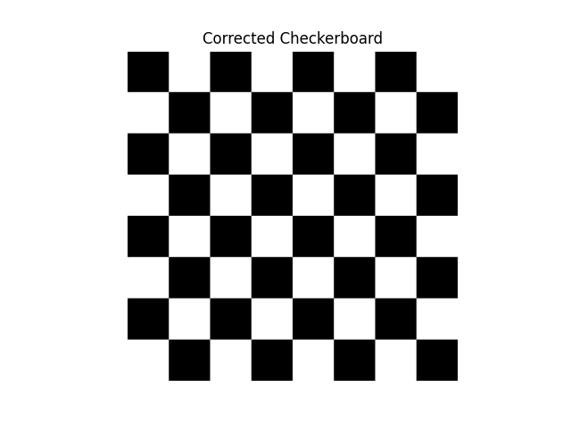
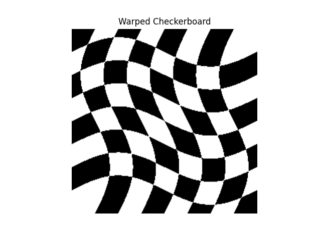
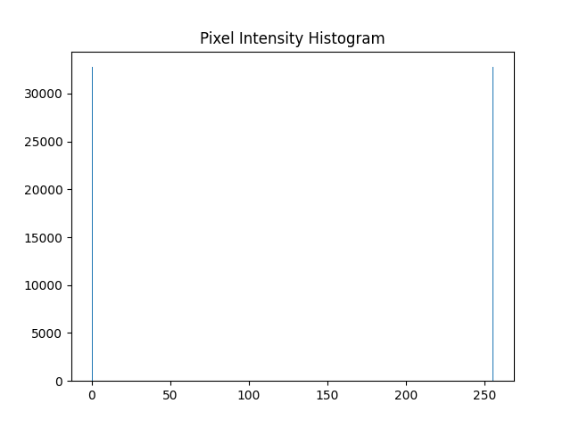

# Checkerboard Image Generation Task

This Task involves generating a checkerboard image with smoothly changing colors, calculating its mean and standard deviation, drawing its histogram, and creating a warped version of the checkerboard. The implementation is done in Python using `numpy` for array operations and `matplotlib` for visualization.

---

## Table of Contents
1. [Task Description](#task-description)
2. [Requirements](#requirements)
3. [How to Run the Code](#how-to-run-the-code)
4. [Output](#output)
5. [License](#license)

---

## Task Description

The task consists of the following steps:

1. **Generate a Checkerboard Image**:
   - Create a checkerboard pattern.

2. **Calculate Mean and Standard Deviation**:
   - Compute the mean and standard deviation of the pixel values in the generated image.

3. **Draw the Histogram**:
   - Plot the histogram of the pixel intensities in the image.

4. **Create a Warped Checkerboard**:
   - Apply a warp effect to the checkerboard image using sinusoidal transformations.

---


## Requirements

To run the code, you need the following Python libraries:

- `numpy`
- `matplotlib`

You can install the required libraries using `pip`:

```bash
pip install numpy matplotlib
```

---

## How to Run the Code

1. Clone the repository or download the Python script.
2. Ensure you have the required libraries installed (see [Requirements](#requirements)).
3. Run the Python script:

```bash
python main.py
```

4. The script will:
   - Generate and display the checkerboard image.
   - Print the mean and standard deviation of the pixel values.
   - Display the histogram of the pixel intensities.
   - Generate and display the warped checkerboard image.

---

## Output

The script produces the following outputs:

1. **Checkerboard Image**:
   - A checkerboard pattern with smoothly changing colors.

2. **Mean and Standard Deviation**:
   - Printed in the console.

3. **Histogram**:
   - A plot showing the distribution of pixel intensities.

4. **Warped Checkerboard**:
   - A distorted version of the checkerboard image created using sinusoidal transformations.

---

## License

This project is licensed under the MIT License. See the [LICENSE](LICENSE) file for details.

---

## Example Output

### Checkerboard Image


### Warped Checkerboard


### Histogram

